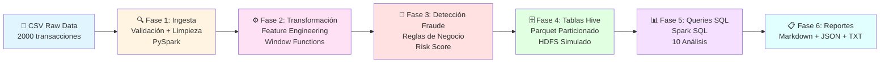

## 🏗️ Arquitectura del Pipeline


### **Flujo Detallado**

| Fase | Tecnología | Input | Output | Tiempo |
|------|------------|-------|--------|--------|
| **1️⃣ Ingesta** | PySpark + Validators | `transactions.csv` | `transactions_validated.parquet` | ~6s |
| **2️⃣ Transformación** | PySpark + Window Functions | Parquet validado | Parquet particionado (año/mes/día) | ~5s |
| **3️⃣ Detección Fraude** | Reglas de negocio | Datos transformados | `fraud_alerts.parquet` + CSV | ~3s |
| **4️⃣ Tablas Hive** | Spark SQL | Parquet procesado | Tablas SQL + DDL | ~2s |
| **5️⃣ Queries Analíticas** | Spark SQL | Tablas Hive | `analytics_results.json` | ~4s |
| **6️⃣ Reportes** | Python | Todos los resultados | Reportes MD/TXT/JSON | ~2s |

### **Stack Tecnológico**

<div align="center">

| Componente | Tecnología | Propósito |
|:----------:|:----------:|-----------|
| 🔥 **Procesamiento** | Apache Spark 3.5 | Motor de procesamiento distribuido |
| 🐍 **Lenguaje** | Python 3.9 + PySpark | Desarrollo del pipeline |
| 💾 **Storage** | Parquet + Snappy | Formato columnar comprimido |
| 🗄️ **Metadatos** | Spark SQL (Hive) | Gestión de tablas y queries |
| 📊 **Analytics** | SQL + DataFrame API | Análisis de datos |
| 🔍 **Validación** | Custom Validators | Calidad de datos |
| 📝 **Logging** | Python logging | Observabilidad |

</div>

### **Simulación del Ecosistema Cloudera**
```
┌─────────────────────────────────────────────────────────────┐
│                    PROYECTO LOCAL                           │
├─────────────────────────────────────────────────────────────┤
│  data/raw/          →  HDFS /user/data/raw/                 │
│  data/processed/    →  HDFS /user/data/processed/           │
│  Spark local[*]     →  YARN cluster                         │
│  Spark SQL          →  Hive/Impala                          │
│  Parquet files      →  HDFS blocks                          │
└─────────────────────────────────────────────────────────────┘
```

### **Características de Escalabilidad**

✅ **Particionado inteligente**: Datos divididos por año/mes/día  
✅ **Formato columnar**: Parquet reduce I/O hasta 10x vs CSV  
✅ **Compresión Snappy**: Balance perfecto entre velocidad y tamaño  
✅ **Configuración adaptativa**: Spark ajusta automáticamente las particiones  
✅ **Window Functions**: Procesamiento eficiente por ventanas  
✅ **Predicate Pushdown**: Solo lee datos necesarios  

### **De Local a Producción**

| Aspecto | Local (Desarrollo) | Cloudera (Producción) |
|---------|-------------------|----------------------|
| **Storage** | Carpetas locales | HDFS distribuido |
| **Compute** | `local[*]` | YARN cluster |
| **Scheduler** | Manual | Airflow/Oozie |
| **Monitoring** | Logs locales | Cloudera Manager |
| **Security** | Sin autenticación | Ranger + Knox |
| **Metadata** | Spark SQL | Hive Metastore |

🤝 Casos de Uso
Este proyecto demuestra capacidades aplicables a:

Sector Bancario: Detección de fraude en tiempo real
E-commerce: Análisis de comportamiento de compra
Telecomunicaciones: Procesamiento de logs de red
IoT: Análisis de eventos de sensores
Marketing: Segmentación de clientes


📖 Documentación Adicional

Guía de Desarrollo (próximamente)
Arquitectura Detallada (próximamente)
Preguntas Frecuentes (próximamente)


👤 Autor
Jhon Limones
MLOps Engineer | DevOps Specialist | Data Engineer

📧 Email: [jhonlimones.developer@gmailcom]
💼 LinkedIn: [https://www.linkedin.com/in/jhon-limones-992b7b331/]
🐙 GitHub: https://github.com/jhonlimones


📄 Licencia
Este proyecto está bajo la Licencia MIT - ver el archivo LICENSE para más detalles.

🙏 Agradecimientos
Proyecto desarrollado como demostración técnica para la posición de Cloudera Data Engineer.
Formación base: Analista de Datos Big Data (120h) - Cloudera - Academia PUE DATA

⭐ Si te resultó útil
Si este proyecto te ayudó, considera darle una ⭐ en GitHub!

Desarrollado con ❤️ para el ecosistema Cloudera